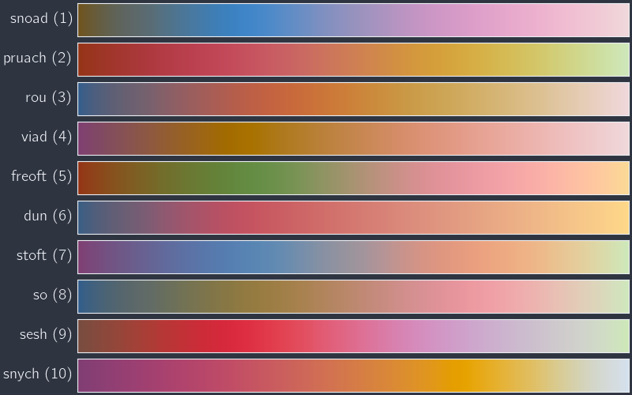
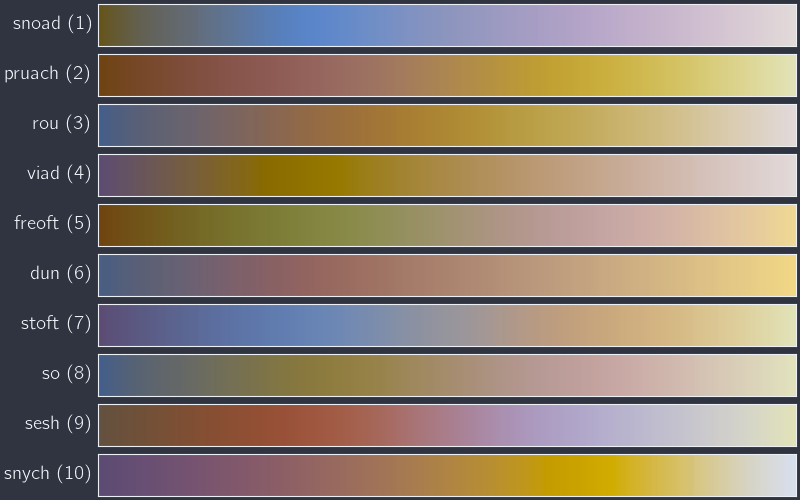

Command-line interface
======================

.. code-block:: none

   python -m sandman ...

Common arguments
----------------

.. program:: sandman

.. option:: --help, -h

   Print the help message for :rainbow:`sandman` or any subcommand of it.

.. option:: --boring

   Refrain from using terminal escapes to make certain text elements look
   like rainbow vomit.

Generating new colormaps
------------------------

.. code-block:: none

   python -m sandman optimize ...

.. program:: optimize

Basic subcommand arguments
^^^^^^^^^^^^^^^^^^^^^^^^^^

.. option:: --save=file

   Save the output data as JSON in the given file, overwriting any
   previous content. If this option is not used, the output is printed
   to :code:`stdout`.

.. option:: --pool=number

   Number of random colors in the pool from which colormap colors are
   chosen. If explicit colors are listed, this option does nothing.

.. option:: --count=number

   Maximum number of colors that should appear in each map. In general,
   including more colors in a map requires more effort to optimize, since
   each color in the map adds two degrees of freedom to the optimization
   problem.

.. option:: --exact

   By default, all permutations of color sequences of length 3 to :code:`count`
   are attempted. This flag changes that behavior and limits the optimization
   to colormaps with exactly :code:`count` colors.

.. option:: --nproc=number

   Number of processors to use during optimization. This code is
   "embarrasingly parallel," meaning that different color permutations
   can be solved independently at the same time.
   :class:`concurrent.futures.ProcessPoolExecutor` is used to parallelize
   the loop over color permutations. By default, only one processor is used.

.. option:: --kind={sequential,diverging,cyclic}

   Kind of colormap to generate. Sequential colormaps increase linearly
   in intensity, while diverging and cyclic maps are non-monotonic.
   Diverging maps will have an intensity peak in the middle. Cyclic
   maps have the same color and intensity at the two ends, making them
   ideal for plotting quantities like angles that naturally "wrap around."

Advanced subcommand arguments
^^^^^^^^^^^^^^^^^^^^^^^^^^^^^

.. option:: --lightdark=number

   If maps appear too dark overall, this option can be used to boost the
   lightness across the map. The value should be an integer in the range
   [0, 100]. Keep in mind that lightness in the HSL space cannot exceed unity,
   though, so this argument, if used, should be small.

.. option:: --saturate=number

   Similarly, maps may appear washed-out or desaturated overall, so this
   option can be used to boost the overall saturation. The value should be
   an integer in the range [0, 100]. Keep in mind that saturation in the
   HSL space cannot exceed unity, though, so this argument, if used,
   should be small.

.. option:: --lowval=number

   Minimum value of perceived intensity; on a sequential map, this is the
   intensity at the far left edge of the map. The value should be an integer
   in the range [0, 100]. The default is 40.

.. option:: --highval=number

   Maximum value of perceived intensity; on a sequential map, this is the
   intensity at the far right edge of the map. The value should be an integer
   in the range [0, 100]. The default is 90.

Example
^^^^^^^

.. parsed-literal::

   python -m sandman optimize --nproc=16 --kind=sequential --save=sequential.json --count=4 --exact --saturate=20 :hexcolor:`bf616a` :hexcolor:`d08770` :hexcolor:`ebcb8b` :hexcolor:`a3be8c` :hexcolor:`81a1c1` :hexcolor:`b48ead`

Previewing colormaps
--------------------

.. code-block:: none

   python -m sandman preview ...

.. program:: preview

Subcommand arguments
^^^^^^^^^^^^^^^^^^^^

.. option:: --rows=number

   Number of rows of colormaps shown in the output image. The total height
   scales linearly with the number of rows. The default value is 10.

.. option:: --cols=number

   Number of columns of colormaps shown in the output image. The total width
   scales linearly with the number of columns. The default value is 2.

.. option:: --save=file

   Save the output image to the given file, overwriting any previous content.
   The image format corresponding to the file extension is used. If this option
   is not used, the image is shown in a window.

Example
^^^^^^^

.. code-block:: none

   python -m sandman preview sequential.json --rows=10 --cols=1

Simulating color vision deficiency
----------------------------------

.. code-block:: none

   python -m sandman simulate ...

.. program:: simulate

Subcommand arguments
^^^^^^^^^^^^^^^^^^^^

.. option:: --rows=number

   Number of rows of colormaps shown in the output image. The total height
   scales linearly with the number of rows. The default value is 10.

.. option:: --cols=number

   Number of columns of colormaps shown in the output image. The total width
   scales linearly with the number of columns. The default value is 2.

.. option:: --save=file

   Save the output image to the given file, overwriting any previous content.
   The image format corresponding to the file extension is used. If this option
   is not used, the image is shown in a window.

.. option:: --cvd={protanomaly,deuteranomaly,tritanomaly,achromatomaly}

   Type of color vision deficiency (CVD) to apply to the colormap preview image.

Example
^^^^^^^

.. code-block:: none

   python -m sandman simulate sequential.json --rows=10 --cols=1 --cvd=protanomaly --severity=50

